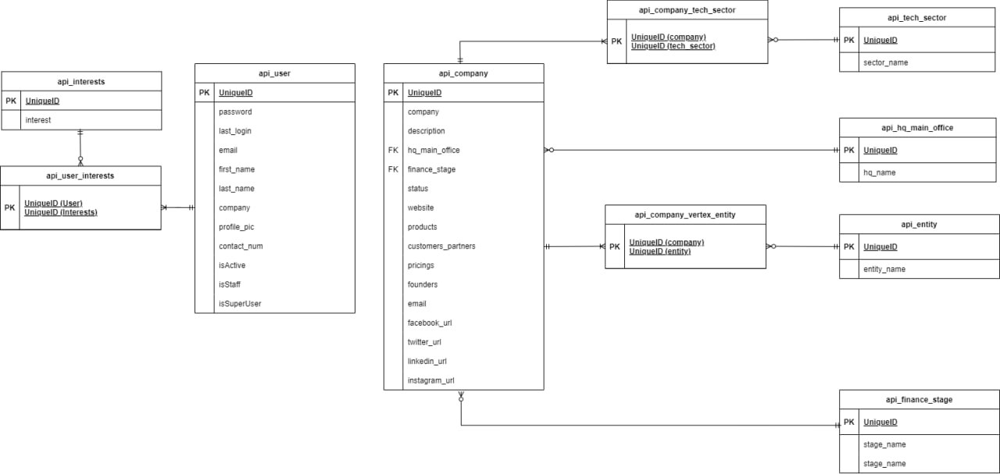

# IS483-T1-Portfolio-Marketplace

Vertex Holdings faces a critical need for an advanced portfolio marketplace that can enhance the visibility of its current portfolio companies while fostering and facilitating meaningful interactions in the venture capital business landscape.

With the increase of portfolios under its umbrella, it requires a system that could intelligently suggest tailored and precise recommendations to potential investors while effectively showcasing its portfolio to relevant stakeholders such as the firm's limited partners, general partners as well as corporate.

This project aims to leverage technologies such as data analytics and artificial intelligence to build a web application that would serve as a bridge between potential investors and startups that share similar ambitions and values.

## Table Of Contents:

- [Tech Stack](#tech-stack)
- [Database Model](#database-model)
- [Pre-requisites](#pre-requisites)
- [Local Setup Steps](#local-setup-steps)
- [Frontend](#frontend)
  - [Frontend Folder Structure](#frontend-folder-structure)
  - [Frontend Environment Variables](#frontend-environment-variables)
- [Backend](#backend)
  - [Backend Folder Structure](#backend-folder-structure)
  - [Backend Environment Variables](#backend-environment-variables)
- [APIs](#apis)
- [Web Scraper](#web-scraper)
- [Semantic Search](#semantic-search)
- [Others](#others)
  - [How to run backend tests](#how-to-run-backend-tests)
  - [How to run frontend tests](#how-to-run-frontend-tests)


### Tech Stack
React, Tailwind CSS, PostgreSQL, Django REST framework, Haystack by Deepset, Hugging Face (Tiiuae/Falcon-7b, Tiiuae/Falcon-7b-instruct, all-MiniLM-L6-v2, ms-macro-MiniLM-L-6-v2, Facebook/bart-large-cnn), Serper, Selenium.

### Database Model


### Pre-requisites
1. Connection to PostgreSQL [See Backend Environment Variables](#backendEnv)
2. [Huggingface.co](https://huggingface.co) account with user access token
3. [Serper.dev](https://serper.dev) account with API Key

### Local Setup Steps
Setup for Frontend

1. `cd frontend`
2. `npm install`
3. `npx tailwindcss init -p`

Setup for Backend

1. `python -m venv venv`
2. `venv\Scripts\activate` (Windows) `source venv/bin/activate` (MacOS)
3. `python.exe -m pip install --upgrade pip`
4. `python.exe -m pip install -r requirements.txt`
5. `python manage.py makemigrations`
6. `python manage.py migrate`
7. `python manage.py createsuperuser`

#### Start Development Server (while in virtual environment)
- Frontend
    1. `cd frontend`
    2. `npm run dev`
- Backend
    1. `cd backend`
    2. `python manage.py runserver`
### Frontend
#### FrontEnd Folder Structure
```
- /frontend                   # FrontEnd Directory
  - /src                      # FrontEnd Source files
    - /assets                 # Static images and video
    - /components             # React components
    - /constants              # Constant values
    - /routes                 # Pages
    - /test                   # Setup for testing library
    - /tests                  # FrontEnd Tests
    - /utils                  # Utility functions
```

#### Frontend Environment Variables
```
VITE_API_URL=<BACKEND_API_URL>
```
### Backend
#### Backend Folder Structure
```
- /backend                    # Backend Directory
  - /api                      # Backend Source files
    - /constants              # Constant Values
    - /migrations             # Database model update history
    - /semantic_search        # Semantic Search / Recommendation Model
    - /tests                  # Backend Tests
```

#### Backend Environment Variables
```
SECRET_KEY=<DJANGO_SETTINGS.PY_SECRET_KEY>
DB_USER=<DATABASE_USERNAME>
DB_PASSWORD=<DATABASE_PASSWORD>
DB_HOST=<DATABASE_HOST_URL>
DB_PORT=<DATABASE_PORT>
HUGGINGFACE_API_TOKEN=<HUGGINGFACE_USER_ACCESS_TOKEN>
```

### APIs
Link to API documentation [here](./API_DOCUMENTATION.md).

### Web scraper 
#### Pre-requisites
1. CSV file with list of companies in the same directory as the crawler_final.py with the following headers:
    - ```| company | website | description | tech_sector | hq_main_office | vertex_entity | finance_stage | status | id |```
2. Enter in virtual environment terminal to set environment variable for webscraper:
    - ```os.environ["SERPERDEV_API_KEY"] = "<SERPERDEV_API_KEY>"```
    - ```os.environ["HF_API_KEY"] = "<HUGGINGFACE_USER_ACCESS_TOKEN>"```

#### Steps to run
1. `python crawler_final.py ./<INPUT CSV FILE>` 
    - Expected output: CSV file('webscraped_data.csv') with scraped content ready for import into database in the same file directory

### Semantic Search
#### Pre-requisites
1. Database and backend API server running

#### Steps to run
1. Run the following to train the model in the virtual environment terminal root folder:
    - `python -c "import sys; sys.path.append('backend/api/semantic_search'); from semantic_search import train_search_model; train_search_model()"`
    - Expected output: Creates "semantic_search.fiass" and "semantic_search.json"

### Others

#### How to run backend tests
1. `cd backend`
2. `python manage.py test`

#### How to run frontend tests
1. `cd frontend`
2. `npm run test`
